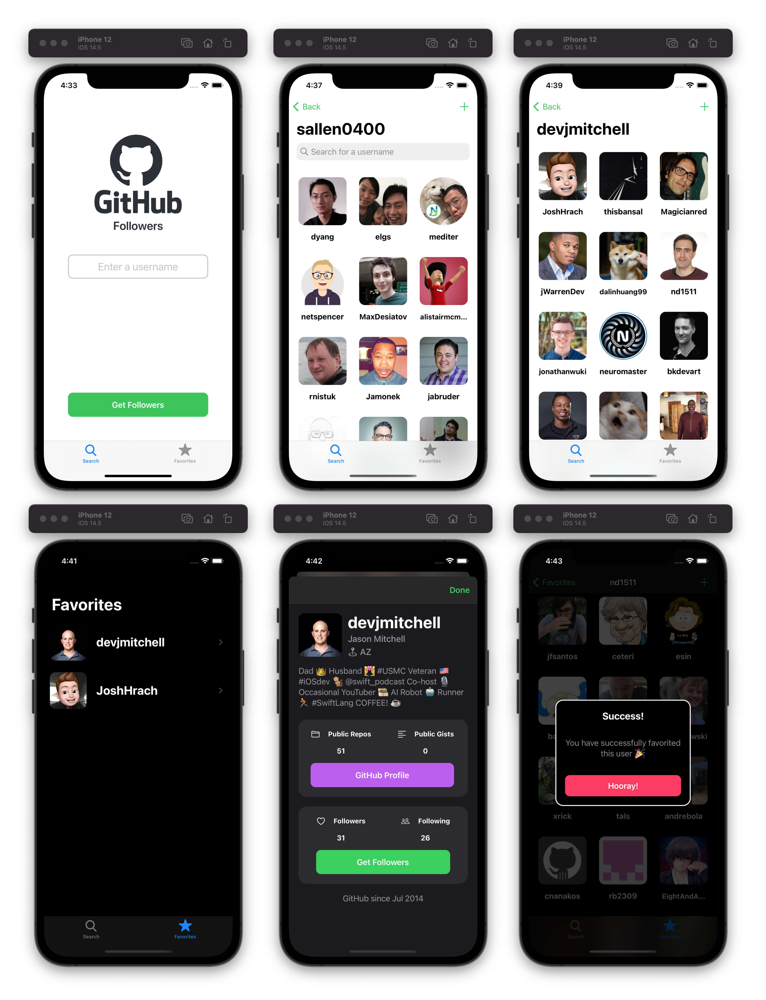

# About

This app is based in the Sean Allen's take home project: https://seanallen.teachable.com

# Featuring

- 100% programmatic UI; no storyboards
- Codable to parse JSON using Generics
- Memory management
- Caching images
- Pagination
- Empty States
- Handling Errors
- Collection Views with Diffable Data Source
- Search Controller
- Composition & avoiding massive view controllers
- Dark/Light mode
- Storing favorite users with UserDefaults
- Delegates/Protocol

# Screenshot
  
